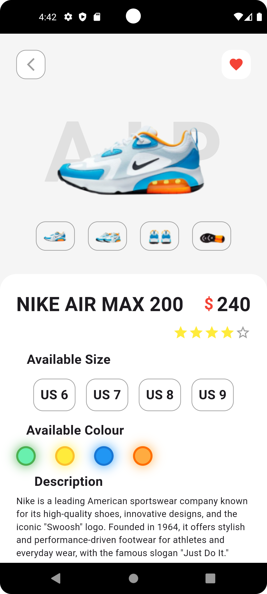

👟 Shoes Store UI

A modern and elegant Shoes Store UI built with Flutter. This project showcases a clean and user-friendly e-commerce interface featuring product categories, search functionality, trending products, favorites, and bottom navigation. The design focuses on providing a smooth and visually appealing shopping experience.

✨ Features
Modern and clean user interface
Product categories section
Search bar for products
Trending products display
Favorite (Wishlist) functionality UI
Bottom navigation bar
Responsive Flutter layout
🛠️ Built With
Flutter
Dart
📱 Screenshots

   

🎯 Purpose

This project was created to practice Flutter UI development, responsive layouts, custom widgets, and modern e-commerce design principles.

Developed with Flutter ❤️

